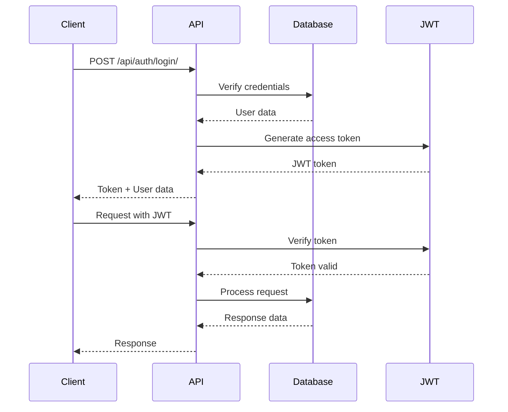
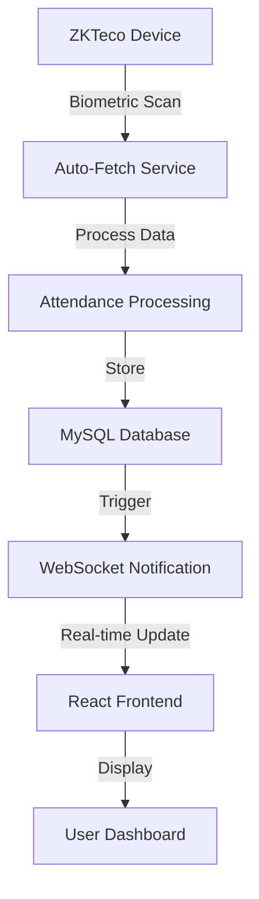
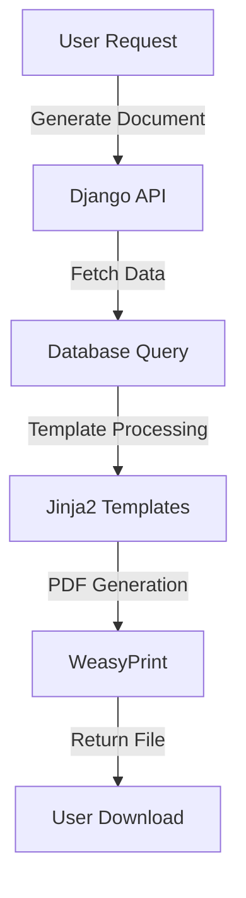

# Technical Architecture & Implementation Guide
## Employee Attendance Management System

---

## 🏗️ **SYSTEM ARCHITECTURE OVERVIEW**

### **High-Level Architecture**
```
┌─────────────────────────────────────────────────────────────────┐
│                        CLIENT LAYER                            │
├─────────────────────────────────────────────────────────────────┤
│  React Frontend (Port 3000) │ Mobile Apps │ Third-party APIs   │
└─────────────────────┬───────────────────────────────────────────┘
                      │ HTTPS/WSS
┌─────────────────────▼───────────────────────────────────────────┐
│                      API GATEWAY                               │
├─────────────────────────────────────────────────────────────────┤
│  Apache2 (Port 80/443) │ Load Balancer │ SSL Termination      │
└─────────────────────┬───────────────────────────────────────────┘
                      │
┌─────────────────────▼───────────────────────────────────────────┐
│                   APPLICATION LAYER                            │
├─────────────────────────────────────────────────────────────────┤
│  Django API Server │ WebSocket Server │ Background Services    │
└─────────────────────┬───────────────────────────────────────────┘
                      │
┌─────────────────────▼───────────────────────────────────────────┐
│                    DATA LAYER                                  │
├─────────────────────────────────────────────────────────────────┤
│  MySQL Database │ Redis Cache │ File Storage │ Log Files        │
└─────────────────────┬───────────────────────────────────────────┘
                      │
┌─────────────────────▼───────────────────────────────────────────┐
│                  INTEGRATION LAYER                             │
├─────────────────────────────────────────────────────────────────┤
│  ZKTeco Devices │ External APIs │ Email Services │ SMS Gateway  │
└─────────────────────────────────────────────────────────────────┘
```

---

## 🔧 **BACKEND ARCHITECTURE**

### **Django Application Structure**
```
EmployeeAttandance/
├── core/                          # Main application
│   ├── models.py                  # Database models
│   ├── views.py                   # API endpoints
│   ├── serializers.py             # Data serialization
│   ├── urls.py                    # URL routing
│   ├── consumers.py               # WebSocket handlers
│   ├── essl_service.py           # ZKTeco integration
│   ├── document_views.py         # Document generation
│   ├── authentication.py         # Custom auth backend
│   ├── middleware.py             # Custom middleware
│   └── management/
│       └── commands/              # Django management commands
├── attendance_system/             # Project settings
│   ├── settings.py               # Configuration
│   ├── urls.py                   # Main URL routing
│   ├── wsgi.py                   # WSGI configuration
│   └── asgi.py                   # ASGI configuration
├── requirements.txt              # Python dependencies
└── manage.py                     # Django management
```

### **Database Schema Design**

#### **Core Models**
```python
# User Management
CustomUser (AbstractUser)
├── role: admin|manager|employee|accountant
├── office: ForeignKey(Office)
├── department: ForeignKey(Department)
├── designation: ForeignKey(Designation)
├── employee_id: CharField
├── biometric_id: CharField
└── profile fields (address, phone, etc.)

# Organizational Structure
Office
├── name, address, contact details
├── managers: ManyToMany(CustomUser)
└── is_active: BooleanField

Department
├── name, description
└── is_active: BooleanField

Designation
├── name, department
└── is_active: BooleanField

# Attendance Tracking
Attendance
├── user: ForeignKey(CustomUser)
├── date: DateField
├── check_in_time: DateTimeField
├── check_out_time: DateTimeField
├── total_hours: DecimalField
├── status: present|absent
├── day_status: complete_day|half_day|absent
├── is_late: BooleanField
├── late_minutes: IntegerField
└── device: ForeignKey(Device)

# Device Integration
Device
├── name, ip_address, port
├── office: ForeignKey(Office)
├── is_active: BooleanField
└── last_sync: DateTimeField

DeviceUser
├── device: ForeignKey(Device)
├── device_user_id: IntegerField
├── device_name: CharField
├── system_user: ForeignKey(CustomUser)
└── is_active: BooleanField
```

### **API Architecture**

#### **REST API Endpoints**
```python
# Authentication
POST /api/auth/login/              # User login
POST /api/auth/logout/             # User logout
POST /api/auth/refresh/            # Token refresh

# User Management
GET  /api/users/                   # List users
POST /api/users/                   # Create user
GET  /api/users/{id}/              # Get user details
PUT  /api/users/{id}/              # Update user
DELETE /api/users/{id}/            # Delete user

# Attendance Management
GET  /api/attendance/              # List attendance
POST /api/attendance/              # Create attendance
GET  /api/attendance/my/           # Current user attendance
GET  /api/attendance/user/{id}/    # User-specific attendance

# Office Management
GET  /api/offices/                 # List offices
POST /api/offices/                 # Create office
PUT  /api/offices/{id}/            # Update office

# Document Generation
POST /api/documents/generate/      # Generate documents
GET  /api/documents/templates/     # List templates
```

#### **WebSocket Channels**
```python
# Real-time Communication
ws://domain/ws/attendance/         # Attendance updates
ws://domain/ws/notifications/      # System notifications
ws://domain/ws/device-status/      # Device status updates
```

---

## 🎨 **FRONTEND ARCHITECTURE**

### **React Application Structure**
```
frontend/accountdashboard/src/
├── components/                    # Reusable components
│   ├── Attendance/               # Attendance-specific components
│   │   ├── AttendanceHeader.jsx
│   │   ├── AttendanceStats.jsx
│   │   ├── AttendanceFilters.jsx
│   │   └── AttendanceTable.jsx
│   ├── UsersFiles/               # User management components
│   │   └── UserFilters.jsx
│   ├── Sidebar.jsx               # Navigation sidebar
│   └── LoadingSpinner.jsx        # Loading components
├── contexts/                     # React contexts
│   ├── AuthContext.js            # Authentication state
│   └── AppContext.js             # Application state
├── layouts/                      # Layout components
│   └── MainLayout.jsx            # Main application layout
├── pages/                        # Page components
│   ├── Dashboard.jsx             # Dashboard page
│   ├── Users.jsx                 # Users management
│   ├── Attendance.jsx            # Attendance tracking
│   └── Profile.jsx               # User profile
├── services/                     # API services
│   └── api.js                    # HTTP client
├── config/                       # Configuration
│   └── routes.js                 # Route definitions
└── utils/                        # Utility functions
    └── helpers.js                # Helper functions
```

### **State Management**
```javascript
// Authentication Context
const AuthContext = {
  user: User | null,
  login: (credentials) => Promise,
  logout: () => void,
  isAuthenticated: boolean
}

// Application Context
const AppContext = {
  loading: boolean,
  error: string | null,
  getUserDisplayName: () => string,
  getUserInitials: () => string
}
```

### **Component Architecture**
```javascript
// Component Hierarchy
MainLayout
├── Sidebar (Navigation)
├── TopBar (User info, logout)
└── MainContent
    ├── Dashboard (Stats, analytics)
    ├── Users (User management)
    ├── Attendance (Attendance tracking)
    └── Profile (User profile)
```

---

## 🔌 **INTEGRATION ARCHITECTURE**

### **ZKTeco Device Integration**
```python
# Device Communication Protocol
class ZKTecoService:
    def __init__(self, device_ip, device_port):
        self.device_ip = device_ip
        self.device_port = device_port
        self.connection = None
    
    def connect(self):
        # Establish connection to ZKTeco device
    
    def get_users(self):
        # Fetch users from device
    
    def get_attendance(self, start_date, end_date):
        # Fetch attendance logs from device
    
    def sync_users(self):
        # Sync device users with system users
    
    def process_attendance(self, attendance_data):
        # Process and store attendance data
```

### **Auto-Fetch Service Architecture**
```python
# Background Service
class AutoAttendanceService:
    def __init__(self):
        self.devices = [
            {'ip': '192.168.200.150', 'port': 4370, 'name': 'Ace Track'},
            {'ip': '192.168.150.74', 'port': 4370, 'name': 'Bootcamp'},
            {'ip': '192.168.200.64', 'port': 4370, 'name': 'DOS Attendance'}
        ]
        self.running = False
    
    def start_service(self):
        # Start background attendance fetching
    
    def stop_service(self):
        # Stop background service
    
    def fetch_attendance_loop(self):
        # Main fetching loop (30-second intervals)
```

---

## 🗄️ **DATABASE ARCHITECTURE**

### **MySQL Configuration**
```sql
-- Database Configuration
CREATE DATABASE employee_attendance;
CREATE USER 'attendance_user'@'localhost' IDENTIFIED BY 'secure_password';
GRANT ALL PRIVILEGES ON employee_attendance.* TO 'attendance_user'@'localhost';

-- Connection Pooling
SET GLOBAL max_connections = 200;
SET GLOBAL innodb_buffer_pool_size = 1G;
SET GLOBAL query_cache_size = 64M;
```

### **Indexing Strategy**
```sql
-- Performance Indexes
CREATE INDEX idx_attendance_user_date ON attendance(user_id, date);
CREATE INDEX idx_attendance_date ON attendance(date);
CREATE INDEX idx_user_office ON customuser(office_id);
CREATE INDEX idx_user_role ON customuser(role);
CREATE INDEX idx_device_user_device ON deviceuser(device_id);
```

### **Data Relationships**
```
CustomUser (1) ──→ (M) Office
CustomUser (1) ──→ (M) Attendance
Office (1) ──→ (M) Device
Device (1) ──→ (M) DeviceUser
DeviceUser (M) ──→ (1) CustomUser
```

---

## 🔒 **SECURITY ARCHITECTURE**

### **Authentication Flow**


### **Authorization Levels**
```python
# Role-based Permissions
PERMISSIONS = {
    'admin': ['read', 'write', 'delete', 'manage_users', 'manage_devices'],
    'manager': ['read', 'write', 'manage_team'],
    'accountant': ['read', 'write', 'generate_reports'],
    'employee': ['read', 'update_profile']
}
```

### **Security Measures**
- **JWT Token Authentication** with refresh mechanism
- **HTTPS Encryption** for all communications
- **CORS Configuration** for cross-origin requests
- **SQL Injection Protection** through Django ORM
- **XSS Protection** through template escaping
- **CSRF Protection** for state-changing operations

---

##  **MONITORING & LOGGING**

### **Application Logging**
```python
# Logging Configuration
LOGGING = {
    'version': 1,
    'disable_existing_loggers': False,
    'formatters': {
        'verbose': {
            'format': '{levelname} {asctime} {module} {process:d} {thread:d} {message}',
            'style': '{',
        },
    },
    'handlers': {
        'file': {
            'level': 'INFO',
            'class': 'logging.FileHandler',
            'filename': 'logs/django.log',
            'formatter': 'verbose',
        },
        'console': {
            'level': 'DEBUG',
            'class': 'logging.StreamHandler',
            'formatter': 'verbose',
        },
    },
    'loggers': {
        'django': {
            'handlers': ['file', 'console'],
            'level': 'INFO',
            'propagate': True,
        },
    },
}
```

### **Performance Monitoring**
```python
# Health Check Endpoints
@api_view(['GET'])
def health_check(request):
    return Response({
        'status': 'healthy',
        'database': check_database_connection(),
        'redis': check_redis_connection(),
        'devices': check_device_connections(),
        'timestamp': timezone.now()
    })
```

---

##  **DEPLOYMENT ARCHITECTURE**

### **Production Environment**
```bash
# Server Configuration
OS: Ubuntu 20.04+ LTS
Web Server: Apache2 with mod_wsgi
Database: MySQL 8.0+
Cache: Redis 6.0+
SSL: Let's Encrypt Certificate
Domain: company.d0s369.co.in
```

### **Apache Configuration**
```apache
<VirtualHost *:80>
    ServerName company.d0s369.co.in
    Redirect permanent / https://company.d0s369.co.in/
</VirtualHost>

<VirtualHost *:443>
    ServerName company.d0s369.co.in
    DocumentRoot /var/www/html
    
    SSLEngine on
    SSLCertificateFile /etc/ssl/certs/company.crt
    SSLCertificateKeyFile /etc/ssl/private/company.key
    
    WSGIDaemonProcess attendance python-path=/path/to/project
    WSGIProcessGroup attendance
    WSGIScriptAlias / /path/to/project/attendance_system/wsgi.py
    
    Alias /static/ /path/to/project/staticfiles/
    <Directory /path/to/project/staticfiles/>
        Require all granted
    </Directory>
</VirtualHost>
```

### **Service Management**
```bash
# Systemd Services
[Unit]
Description=Django Attendance System
After=network.target mysql.service redis.service

[Service]
Type=exec
User=www-data
Group=www-data
WorkingDirectory=/path/to/project
Environment=DJANGO_SETTINGS_MODULE=attendance_system.settings
ExecStart=/path/to/venv/bin/python manage.py runserver 0.0.0.0:8000
Restart=always

[Install]
WantedBy=multi-user.target
```

---

##  **DATA FLOW ARCHITECTURE**

### **Attendance Data Flow**


### **Document Generation Flow**


---

##  **SCALABILITY CONSIDERATIONS**

### **Horizontal Scaling**
- **Load Balancer**: Multiple Django instances
- **Database Replication**: Read replicas for reporting
- **Redis Cluster**: Distributed caching
- **CDN Integration**: Static file delivery

### **Vertical Scaling**
- **Database Optimization**: Query optimization, indexing
- **Caching Strategy**: Redis for frequent queries
- **Connection Pooling**: Database connection management
- **Background Tasks**: Celery for heavy operations

### **Performance Optimization**
- **Database Indexing**: Optimized query performance
- **API Pagination**: Large dataset handling
- **Caching Layer**: Redis for session and data caching
- **Static File Optimization**: Minification and compression

---

*This technical architecture document provides comprehensive insight into the system design, implementation details, and scalability considerations for the Employee Attendance Management System.*
