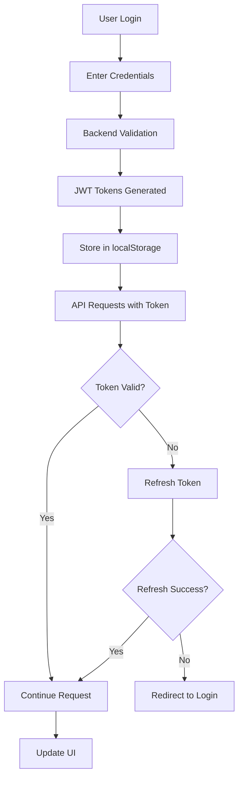

# 🏢 AdminDashboard

<div align="center">


**A modern, responsive React application for comprehensive employee management with JWT authentication**

[🚀 Live Demo](#) • [📖 Documentation](#) • [🐛 Report Bug](#) • [✨ Request Feature](#)

</div>

---

## ✨ Features

### 🔐 **Authentication & Security**
- **JWT Authentication** with access and refresh tokens
- **Automatic token refresh** for seamless user experience
- **Role-based access control** (Admin, Manager, Employee)
- **Secure password management** with change password functionality
- **Protected routes** with automatic redirection

### 📊 **Dashboard & Analytics**
- **Admin Dashboard** with comprehensive statistics and quick actions
- **User Dashboard** with personalized attendance and leave information
- **Real-time data visualization** with charts and graphs
- **Performance metrics** and attendance tracking
- **Department-wise analytics**

### 👥 **User Management**
- **Complete CRUD operations** for user management
- **Role assignment** (Admin, Manager, Employee)
- **Department management**
- **User profile management** with avatar upload
- **Bulk user operations**

### ⏰ **Attendance Management**
- **Clock in/out functionality**
- **Attendance tracking** with timestamps
- **Late arrival detection**
- **Attendance reports** and analytics
- **Monthly attendance trends**

### 📅 **Leave Management**
- **Leave request submission**
- **Leave approval workflow**
- **Leave type management** (Sick, Annual, Personal, etc.)
- **Leave balance tracking**
- **Leave calendar view**

### 📄 **Document Management**
- **Document upload and sharing**
- **Document categorization**
- **Access control** for documents
- **Document versioning**
- **Search and filter functionality**

### 💬 **Team Communication**
- **Real-time chat system**
- **Group chat rooms**
- **Direct messaging**
- **File sharing in chat**
- **Message history**

### 🔔 **Notifications**
- **Real-time notifications**
- **Email notifications**
- **Push notifications**
- **Notification preferences**
- **Notification history**

### 📈 **Reports & Analytics**
- **Comprehensive reporting system**
- **Multiple report types** (Attendance, Leave, Performance, Department)
- **Export functionality** (PDF, Excel, CSV)
- **Custom date ranges**
- **Department-wise filtering**

---

## 🛠️ Tech Stack

<table>
<tr>
<td><strong>Frontend Framework</strong></td>
<td>


</td>
</tr>
<tr>
<td><strong>Styling & UI</strong></td>
<td>


</td>
</tr>
<tr>
<td><strong>State Management</strong></td>
<td>


</td>
</tr>
<tr>
<td><strong>HTTP Client</strong></td>
<td>


</td>
</tr>
<tr>
<td><strong>Development Tools</strong></td>
<td>


</td>
</tr>
</table>

---

## 📁 Project Structure

```
AdminDashboard/
├── 📁 public/                    # Static assets
│   ├── adminbackground.jpg
│   ├── adminbg.png
│   └── companylogo.png
├── 📁 src/
│   ├── 📁 assets/               # Images, fonts, etc.
│   ├── 📁 components/           # Reusable UI components
│   │   ├── 📁 ui/              # Base UI components
│   │   ├── 📁 layout/          # Layout components
│   │   ├── 📁 dashboard/       # Dashboard-specific components
│   │   ├── 📁 attendance/      # Attendance components
│   │   ├── 📁 leaves/          # Leave management components
│   │   ├── 📁 reports/         # Reports components
│   │   └── 📁 icons/           # Custom icons
│   ├── 📁 contexts/            # React contexts
│   │   ├── AuthContext.jsx
│   │   └── NotificationContext.jsx
│   ├── 📁 pages/               # Page components
│   │   ├── 📁 dashboard/
│   │   ├── Login.jsx
│   │   ├── Users.jsx
│   │   ├── Attendance.jsx
│   │   └── ...
│   ├── 📁 services/            # API services
│   │   ├── api.js
│   │   ├── jwtAuth.js
│   │   └── notificationAPI.js
│   ├── 📁 hooks/               # Custom hooks
│   ├── 📁 utils/               # Utility functions
│   ├── App.jsx                 # Main app component
│   ├── main.jsx               # App entry point
│   └── index.css              # Global styles
├── 📄 package.json             # Dependencies and scripts
├── 📄 tailwind.config.js       # Tailwind configuration
├── 📄 vite.config.js           # Vite configuration
└── 📄 README.md               # This file
```

---

## 🎨 Design System

### 🎨 Color Palette
<table>
<tr>
<td><strong>Primary</strong></td>
<td><span style="color: #3b82f6">●</span> Blue (#3b82f6) → <span style="color: #1e3a8a">●</span> Dark Blue (#1e3a8a)</td>
</tr>
<tr>
<td><strong>Secondary</strong></td>
<td><span style="color: #f8fafc">●</span> Light Gray (#f8fafc) → <span style="color: #020617">●</span> Dark Gray (#020617)</td>
</tr>
<tr>
<td><strong>Success</strong></td>
<td><span style="color: #22c55e">●</span> Green (#22c55e) → <span style="color: #052e16">●</span> Dark Green (#052e16)</td>
</tr>
<tr>
<td><strong>Warning</strong></td>
<td><span style="color: #f59e0b">●</span> Yellow (#f59e0b) → <span style="color: #451a03">●</span> Dark Yellow (#451a03)</td>
</tr>
<tr>
<td><strong>Danger</strong></td>
<td><span style="color: #ef4444">●</span> Red (#ef4444) → <span style="color: #450a0a">●</span> Dark Red (#450a0a)</td>
</tr>
<tr>
<td><strong>Info</strong></td>
<td><span style="color: #06b6d4">●</span> Cyan (#06b6d4) → <span style="color: #083344">●</span> Dark Cyan (#083344)</td>
</tr>
</table>

### 📝 Typography
- **Font Family**: Inter (Google Fonts)
- **Font Weights**: 300, 400, 500, 600, 700
- **Responsive**: Mobile-first design

### 🧩 Components
- **Buttons**: Primary, secondary, danger variants
- **Cards**: Content containers with shadows
- **Inputs**: Form inputs with validation states
- **Badges**: Status indicators
- **Modals**: Overlay dialogs
- **Tables**: Data display with sorting

---

## 🚀 Getting Started

### 📋 Prerequisites
- **Node.js** (v18 or higher)
- **npm** or **yarn**
- **Backend API** running on `http://localhost:8000`

### 🔧 Installation

1. **Clone the repository**
   ```bash
   git clone https://github.com/bkbimal250/ClientAdmindashboard.git
   cd ClientAdmindashboard
   ```

2. **Install dependencies**
   ```bash
   npm install
   ```

3. **Start development server**
   ```bash
   npm run dev
   ```

4. **Open in browser**
   ```
   http://localhost:5174
   ```

### 🏗️ Build for Production

```bash
# Build the project
npm run build

# Preview production build
npm run preview
```

---

## ⚙️ Configuration

### 🔐 Environment Variables
Create a `.env` file in the root directory:

```env
VITE_API_BASE_URL=http://localhost:8000/api
VITE_APP_NAME=Employee Attendance System
VITE_APP_VERSION=1.0.0
```

### 🔗 API Configuration
The application is configured to work with the Django backend API. Ensure the backend is running and accessible at the configured URL.

---

## 📱 Responsive Design

The application is fully responsive and optimized for:

| Device | Screen Size | Features |
|--------|-------------|----------|
| 🖥️ **Desktop** | 1024px+ | Full feature set, multi-column layout |
| 📱 **Tablet** | 768px - 1023px | Optimized touch interface |
| 📱 **Mobile** | 320px - 767px | Single column, touch-friendly |

---

## 🔐 Authentication Flow



---

## 🎯 Key Features Implementation

### 🔑 JWT Authentication Service
- **Automatic token management**
- **Request/response interceptors**
- **Error handling and retry logic**
- **Token expiration detection**

### 👤 Role-Based Access Control
- **Admin**: Full system access
- **Manager**: Department management
- **Employee**: Personal data and basic features

### ⚡ Real-Time Features
- **Live notifications**
- **Real-time chat**
- **Attendance updates**
- **Status indicators**

---

## 🧪 Testing

### 🔍 Manual Testing Checklist
- [ ] **Login/Logout**: Test authentication flow
- [ ] **Navigation**: Test all routes and menus
- [ ] **Forms**: Test form validation and submission
- [ ] **Responsive**: Test on different screen sizes
- [ ] **Permissions**: Test role-based access

### 🌐 Browser Compatibility
- ✅ **Chrome** (recommended)
- ✅ **Firefox**
- ✅ **Safari**
- ✅ **Edge**

---

## 🚀 Deployment

### 🏗️ Build Process
```bash
npm run build
```

### 🌐 Deployment Options
- **Vercel**: Zero-config deployment
- **Netlify**: Drag and drop deployment
- **AWS S3**: Static website hosting
- **Docker**: Containerized deployment

### 🔧 Environment Setup
1. Set production API URL
2. Configure CORS settings
3. Set up SSL certificates
4. Configure CDN (optional)

---

## 📊 Performance

### ⚡ Optimization Features
- **Code splitting** with React.lazy()
- **Image optimization** with Vite
- **Tree shaking** for unused code removal
- **Minification** for production builds
- **Caching** strategies

### 📈 Performance Metrics
- **First Contentful Paint**: < 1.5s
- **Largest Contentful Paint**: < 2.5s
- **Cumulative Layout Shift**: < 0.1
- **First Input Delay**: < 100ms

---

## 📚 API Documentation

### 🔐 Authentication Endpoints
| Method | Endpoint | Description |
|--------|----------|-------------|
| `POST` | `/api/token/` | Login |
| `POST` | `/api/token/refresh/` | Refresh token |
| `POST` | `/api/token/verify/` | Verify token |

### 👥 User Management
| Method | Endpoint | Description |
|--------|----------|-------------|
| `GET` | `/api/users/` | Get all users |
| `POST` | `/api/users/` | Create user |
| `PUT` | `/api/users/{id}/` | Update user |
| `DELETE` | `/api/users/{id}/` | Delete user |

### ⏰ Attendance
| Method | Endpoint | Description |
|--------|----------|-------------|
| `GET` | `/api/attendance/` | Get attendance records |
| `POST` | `/api/attendance/clock_in/` | Clock in |
| `POST` | `/api/attendance/clock_out/` | Clock out |

### 📅 Leaves
| Method | Endpoint | Description |
|--------|----------|-------------|
| `GET` | `/api/leaves/` | Get leave requests |
| `POST` | `/api/leaves/` | Submit leave request |
| `PUT` | `/api/leaves/{id}/` | Update leave request |

---

## 🤝 Contributing

1. 🍴 Fork the repository
2. 🌿 Create feature branch (`git checkout -b feature/AmazingFeature`)
3. 💾 Make changes
4. ✅ Add tests
5. 📝 Update documentation
6. 🚀 Submit pull request

---

## 📄 License

This project is licensed under the **MIT License** - see the [LICENSE](LICENSE) file for details.

---

## 🆘 Support

For support and questions:
- 🐛 [Create an issue](https://github.com/bkbimal250/ClientAdmindashboard/issues)
- 📧 Contact the development team
- 📖 Check the documentation

---

## 🔄 Updates

### 📈 Version History
- **v1.0.0**: Initial release with basic features
- **v1.1.0**: Added JWT authentication
- **v1.2.0**: Added reports and analytics
- **v1.3.0**: Enhanced UI/UX and performance

### 🗺️ Roadmap
- [ ] Real-time notifications
- [ ] Mobile app
- [ ] Advanced analytics
- [ ] Multi-language support
- [ ] Dark mode theme

---

<div align="center">

**Built with ❤️ using React, Tailwind CSS, and JWT Authentication**

[⬆ Back to Top](#-admindashboard)

</div>